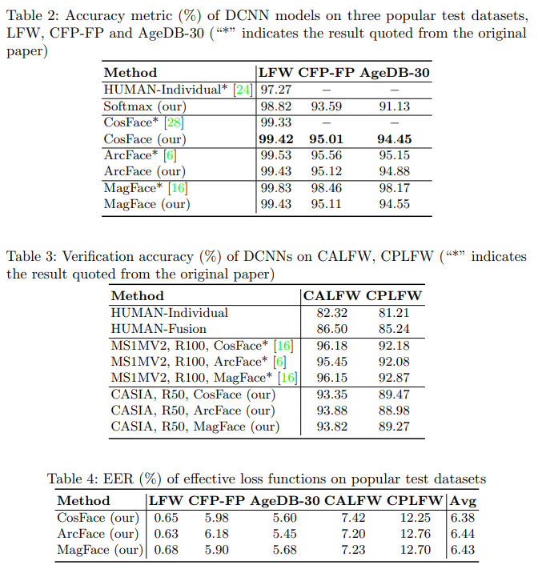

# PE-DCNN:
This repository contains our source code of the paper "Impact Analysis of Different Effective Loss Functions by Using Deep Convolutional Neural Network for Face Recognition" submitted to ICADL 2022.

This paper investigates and analyzes the effect of several effective loss functions based on softmax including CosFace, ArcFace and MagFace. 
The results of our experiments achieve state-of-the-art figures, which show a huge potential of the proposed method in improving performance for face recognition.


# Datasets
- We use CASIA-Webface  for training and some available test sets including LFW, CFP-FP, AgeDB, CALFW, CPLFW for benchmark. All datasets is contributed from [Insightface](https://github.com/deepinsight/insightface/tree/master/recognition/_datasets_)
- Download and extract into _data_ folder. 

# Experiments
We use Python 3.8.10. To install all dependencies, run:
```python
pip install -r requirements.txt
```

Then, you can run directly the code by files in _script_ folder 

```python
Example: bash script/train.sh
or	   : bash script/test.sh
```

# Results




# The contributions of the authors:

* Anh D. Nguyen - 19021208@vnu.edu.vn  - Department of Information Systems, VNU University of Engineering and Technology, Hanoi, Vietnam
* Dat T. Nguyen - 19021226@vnu.edu.vn - Department of Information Systems, VNU University of Engineering and Technology, Hanoi, Vietnam
* Hoa N. Nguyen - Corresponding author - hoa.nguyen@vnu.edu.vn - Department of Information Systems, VNU University of Engineering and Technology, Hanoi, Vietnam
* Hai N. Dao    - namhai249@vnu.edu.vn - VNU Information Technology Institute, Hanoi, Vietnam
* Hai H. Le		- hailh@vnu.edu.vn - Department of Information Systems, VNU University of Engineering and Technology, Hanoi, Vietnam
* Nam Q. Tran   - namtq@ptit.edu.vn - Posts and Telecommunications Institute of Technology, Hanoi, Vietnam
